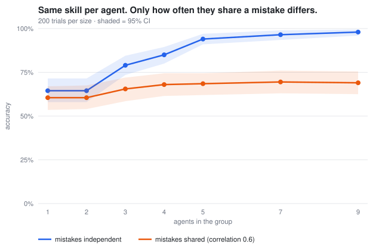
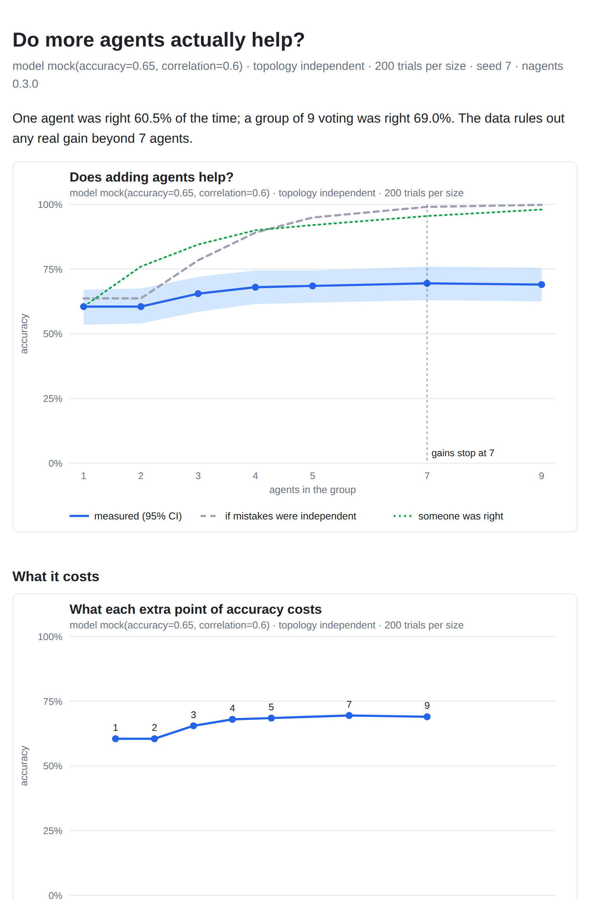

# nagents

**Do more AI agents actually help? Measured.**

A common trick is to ask several AI agents the same question and go with the
majority answer. nagents checks whether that actually works. It gives the
same problems to a group of 1 agent, then 2, 3, and so on up to 9, grades
every answer against the known right one, and shows you:

- **how much each extra agent helps**, with error bars, so a lucky run can't pass for a real gain
- **where extra agents stop helping**, so you know the group size worth paying for
- **why it stops**: how often the agents make *the same mistake*
- **what each extra point of accuracy costs**, in tokens or dollars

Every agent's full reply is saved, so every number traces back to what the
agents actually said.

## The one idea that matters

Voting only helps when agents make *different* mistakes. If they all trip on
the same step and land on the same wrong number, adding more of them just
adds more votes for that wrong number.



*Demo data from the built-in mock model, not a real model. Both groups have
the same skill per agent. With independent mistakes, 9 agents reach 98%.
When agents share mistakes (correlation 0.6), the curve stalls near 69%
after about 4 agents. Real runs measure where actual models fall between
these two lines.*

## Why it's useful

- **Before you pay for 5 agents, find out whether 2 do just as well.** The report
  names the group size where gains stop, and only calls it when the data backs it up.
- **Cost per point.** Each step up in group size shows the extra tokens (or dollars)
  per question and what each +1 point of accuracy cost.
- **Diagnosis, not just a score.** It measures how often agents are wrong together
  and draws the curve you'd get if they weren't, so you can see how much
  shared mistakes cost you.
- **Receipts.** Each run writes a `report.html` with the charts, the numbers, and
  a grid of every trial where each cell links to the full transcript.



## Try it in 10 seconds (free, offline)

```bash
python3 -m nagents run --mock --suite chain --depth 8 --trials 40 --sizes 1,2,3,4,5,7,9 --out runs/demo
open runs/demo/report.html          # or xdg-open on Linux
```

Add `--mock-correlation 0.6` to watch shared mistakes flatten the curve.
No dependencies beyond Python 3.9+.

---

## Running it for real

There are two ways to get real model answers.

### 1. Claude subagents (no API key)

Each agent in a group is answered by a separate Claude subagent. A subagent
gets a batch of *different* problems and answers them by hand, with no tools.
It never sees the same problem twice, so no subagent can agree with itself.

```bash
# 1. Lay out the grid. It stops and lists the calls that need answers.
python3 -m nagents run --subagents "nagents-solver(haiku)" --suite chain --depth 10 \
    --trials 30 --sizes 1,2,3,4,5,7,9 --out runs/sub-d10

# 2. Split them into batches (10 problems per subagent) with the exact prompt for each.
python3 -m nagents batches runs/sub-d10 --prompts runs/sub-d10/prompts

# 3. Give each prompts/bXXX.txt to one subagent (the nagents-solver agent in
#    .claude/agents/), save each reply to a file, then store the answers:
python3 -m nagents ingest runs/sub-d10 replies/*.txt

# 4. Rerun step 1 with --resume. Debate runs loop once more for round 2.
python3 -m nagents run ... --resume
```

For voting groups, seats are shared across group sizes: the 3-agent group
is seats 0 to 2 and the 9-agent group is seats 0 to 8. A grid over sizes up
to 9 therefore needs 9 answers per problem, not 31, and every size is
compared on the same answers. Replies are keyed by a hash of exactly what
the agent saw, so a reply can never be reused for a different question.
Token counts for subagent runs are estimated from text length and marked as
estimates.

### 2. The Claude API

```bash
pip install anthropic
export ANTHROPIC_API_KEY=...   # or an `ant auth login` profile
python3 -m nagents run --suite chain --depth 10 --trials 30 --sizes 1,3,5 --model claude-opus-5 --effort low --out runs/api-01
```

The default model is `claude-opus-5`, and `--effort` maps to `output_config.effort`. There is
deliberately **no fallback to another model** when one refuses: swapping
models mid-run would corrupt the measurement. A refusal is recorded and
scored as wrong. `--workers N` parallelizes calls without changing results.

## Commands

| Command | What it does |
|---|---|
| `run` | Run the grid (`--mock`, `--subagents LABEL`, or the API). `--resume` continues a killed or waiting run. Writes transcripts, `results.json`, `charts/` and `report.html` |
| `report RUN [--html]` | Print the report again (and rebuild charts and HTML) |
| `recompute RUN` | Rebuild results from the transcripts alone. Refuses incomplete runs |
| `compare A B [--chart F.svg]` | Two runs side by side, paired per trial when they used the same tasks (for example debate vs. independent) |
| `batches RUN` / `ingest RUN FILES` | The subagent loop: batch the waiting calls, then store the replies |

## How a run works

1. **Tasks.** Seeded chained-arithmetic problems with one exact integer answer
   (`--depth` sets the difficulty), easy word problems (`arith`), or your own JSONL
   file (`{"id", "prompt", "answer"}` per line).
2. **Paired trials.** Trial *t* gives the same problem to every group size.
3. **Topology.** `independent`: everyone answers alone and the majority wins. `debate`:
   round 1 alone, then each agent sees the others' answers and revises before the vote.
4. **Stats.** Accuracy per size with bootstrap 95% CIs, and a paired gain for each
   step up in size. Gains stop at the smallest size where the paired-CI upper bound
   of every further gain is at most `epsilon` (a looser point-estimate rule is shown
   too). The report also counts refusals and unparsed answers.
5. **Shared mistakes.** Using only first-round answers, it reports the error correlation
   between agents, how often two wrong agents gave the *same* wrong number, the best-case
   curve for independent mistakes, and the "someone in the group was right" ceiling.

Transcripts are the source of truth; `results.json` can be deleted and rebuilt at any time.

## Repo map

```
nagents/
  tasks.py       seeded task suites + JSONL loader
  models.py      MockModel (free; optional shared mistakes) + AnthropicModel
  external.py    subagent answers: pending calls, batches, ingest
  topologies.py  independent / debate
  scoring.py     answer extraction + exact match
  runner.py      the grid; crash-safe, resumable transcripts
  stats.py       bootstrap CIs, paired gains, saturation, shared-mistake stats
  report.py      text report + cost per point
  charts.py      SVG charts (no dependencies)
  html.py        report.html with a link to every transcript
  compare.py     two runs side by side
.claude/agents/nagents-solver.md   the solver subagent (no tools)
docs/make_demo.sh                  rebuilds the README charts from the mock
SPEC.md                            the full plan, phases 0 to 5
```

## Tests

```bash
python3 -m unittest discover -s tests -t . -v
```

Offline, no dependencies. CI runs the tests plus a full mock grid, recompute, and compare on every push.
