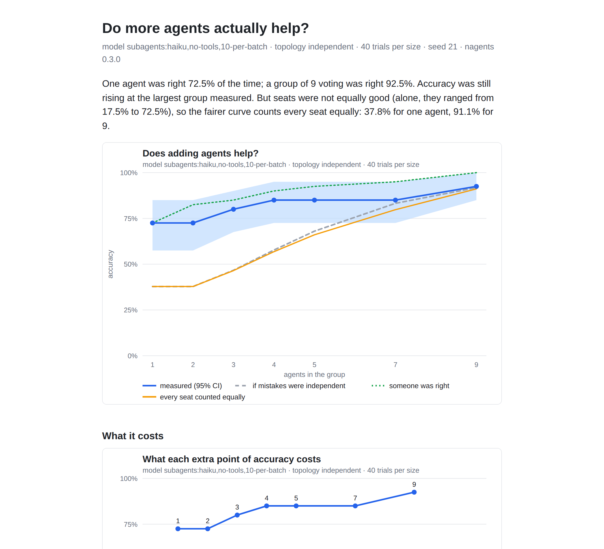

# nagents

**Do more AI agents actually help? Measured.**

A common trick is to ask several AI agents the same question and go with the
majority answer. nagents checks whether that actually works. It gives the
same problems to a group of 1 agent, then 2, 3, and so on up to 9, grades
every answer against the known right one, and reports how much each extra
agent helps (with error bars), where the gains stop, why they stop, and what
each extra point of accuracy costs. Every agent's full reply is saved, so
every number traces back to what an agent actually said.

## What a real run found

We ran Claude Haiku as the agents, 40 long-multiplication problems at each difficulty,
with 9 independent answers per problem. Each agent worked alone, with no tools.


- **Voting works, and keeps working.** On 7-digit problems one agent was right
  58% of the time and a vote of 9 was right 98%. On the harder 8-digit
  problems, 38% became 91%. Neither curve had levelled off by 9 agents.
- **It works even when a single agent is usually wrong.** That sounds
  impossible for a majority vote, but wrong answers almost never matched: two
  wrong agents gave the same wrong number under 1% of the time. The right
  answer only needs to be the most common one, not a majority.
- **Why it works this well:** the agents' mistakes were close to independent
  (error correlation +0.06 and +0.02). The dashed lines show the curve you would
  get with perfectly independent mistakes, and the measured lines sit almost on them.
- **Two agents are no better than one.** When a pair disagrees it is a coin
  toss. Use odd group sizes.
- **Cost grows in a straight line**, about 90 tokens per agent per question.

## Talking it over beats voting, at a price


In a debate each agent answers alone, then sees the others' answers and
revises before the vote. With the same first answers:

| agents | plain vote | debate | debate minus vote (95% CI) | tokens per question (vote / debate) |
|---:|---:|---:|---:|---:|
| 3 | 78% | **100%** | +22 points [+10, +38] | 271 / 702 |
| 5 | 83% | **100%** | +18 points [+8, +30] | 451 / 1,214 |

Debate cost about 2.6 times as many tokens and fixed every miss. In four
problems *no* agent was right at first, yet the revisers pieced together the
right answer from near misses. That is something voting can never do.

## A trap we caught

Agents answer problems in batches of 10, and the **first problem in a batch
got much more care**: it was right 72% of the time against 22 to 44% for the
rest. Our batching always put the solo agent's question first, which
flattered the one-agent score and hid most of the gain from voting. nagents
now shuffles every batch, prints a **seat check** (how good each seat was
alone), and adds a second curve that counts every seat equally. The voting
curves above use that fairer curve. The debate table is a fair comparison
either way, because both sides vote on the same seats' first answers.



*Honest limits: one model, one kind of task, 40 problems per size. The
confidence bands say how far that goes.*

## Why it's useful

- **Before you pay for 5 agents, find out whether 3 do just as well.** The report
  names the group size where gains stop, and only calls it when the data backs it up.
- **Cost per point.** Each step up in group size shows the extra tokens per question
  and what each +1 point of accuracy cost.
- **Diagnosis, not just a score.** It measures how often agents are wrong together,
  which is what decides whether voting can help at all.
- **Receipts.** Each run writes a `report.html` where every cell links to the full transcript.

## Try it in 10 seconds (free, offline)

```bash
python3 -m nagents run --mock --suite chain --depth 8 --trials 40 --sizes 1,2,3,4,5,7,9 --out runs/demo
open runs/demo/report.html          # or xdg-open on Linux
```

The mock model is fake but shows the idea. Add `--mock-correlation 0.6` to
watch shared mistakes flatten the curve. No dependencies beyond Python 3.9+.

---

## Running it for real

### 1. Claude subagents (no API key)

This is how the study above was run. Each seat in a group is answered by a
separate Claude subagent that gets a batch of *different* problems and answers
them with no tools. It never sees the same problem twice, so no subagent can
agree with itself.

```bash
# 1. Lay out the grid. It stops and lists the calls that need answers.
python3 -m nagents run --subagents "haiku,no-tools,10-per-batch" --suite mult --digits 7 \
    --trials 40 --sizes 1,2,3,4,5,7,9 --out runs/m7

# 2. Split them into batches (10 problems per subagent) with the exact prompt for each.
python3 -m nagents batches runs/m7 --prompts runs/m7/prompts

# 3. Give each prompts/bXXX.txt to one subagent (the nagents-solver agent in
#    .claude/agents/), save each reply to a file, then store the answers:
python3 -m nagents ingest runs/m7 runs/m7/replies/*.txt

# 4. Rerun step 1 with --resume. Debate runs loop once more for the revision round.
python3 -m nagents run ... --resume
```

Seats are shared across group sizes: the 3-agent group is seats 0 to 2 and
the 9-agent group is seats 0 to 8. A grid up to 9 therefore needs 9 answers
per problem, not 31, and every size is compared on the same answers. Each
batch mixes seats and is shuffled, so no seat always goes first. Replies are
keyed by a hash of exactly what the agent saw, so a reply can never be reused
for a different question. Token counts for subagent runs are estimated from
text length and marked as estimates.

### 2. The Claude API

```bash
pip install anthropic
export ANTHROPIC_API_KEY=...   # or an `ant auth login` profile
python3 -m nagents run --suite mult --digits 7 --trials 40 --sizes 1,3,5 --model claude-opus-5 --effort low --out runs/api-01
```

`--effort` maps to `output_config.effort`. There is deliberately **no fallback
to another model** when one refuses: swapping models mid-run would corrupt the
measurement. A refusal is recorded and scored as wrong. `--workers N`
parallelizes calls without changing results.

## Commands

| Command | What it does |
|---|---|
| `run` | Run the grid (`--mock`, `--subagents LABEL`, or the API). `--resume` continues a killed or waiting run. Writes transcripts, `results.json`, `charts/` and `report.html` |
| `report RUN [--html]` | Print the report again (and rebuild charts and HTML) |
| `recompute RUN` | Rebuild results from the transcripts alone. Refuses incomplete runs |
| `compare A B [--chart F.svg]` | Two runs side by side, paired per trial when they used the same tasks (for example debate vs. independent) |
| `batches RUN` / `ingest RUN FILES` | The subagent loop: batch the waiting calls, then store the replies |

## How a run works

1. **Tasks.** Seeded problems with one exact integer answer: `mult` (multiply two
   `--digits`-digit numbers), `chain` (chained arithmetic, `--depth` steps), easy word
   problems (`arith`), or your own JSONL file (`{"id", "prompt", "answer"}` per line).
   Haiku solved even 50-step chains perfectly, so `mult` is the suite with real headroom.
2. **Paired trials.** Trial *t* gives the same problem to every group size.
3. **Topology.** `independent`: everyone answers alone and the most common answer wins.
   `debate`: round 1 alone, then each agent sees the others' answers and revises before the vote.
4. **Stats.** Accuracy per size with bootstrap 95% CIs, and a paired gain for each
   step up in size. Gains stop at the smallest size where the paired-CI upper bound
   of every further gain is at most `epsilon`. For independent runs a second curve
   averages over every choice of seats, so no seat's luck or position drives the result.
5. **Shared mistakes.** From first-round answers: the error correlation between agents,
   how often two wrong agents gave the *same* wrong number, the curve for independent
   mistakes, and the "someone in the group was right" ceiling.

Transcripts are the source of truth; `results.json` can be deleted and rebuilt at any time.

## The study data

Every run behind the charts above is committed in `study/`, with each
subagent's prompt and reply: `pilot-*` (choosing the difficulty), `main-m7`
and `main-m8` (the voting curves), `debate-m7` (debate). Open any
`study/*/report.html`, or rebuild the README charts with
`python3 docs/make_study_charts.py`.

## Repo map

```
nagents/
  tasks.py       seeded task suites + JSONL loader
  models.py      MockModel (free; optional shared mistakes) + AnthropicModel
  external.py    subagent answers: pending calls, shuffled batches, ingest
  topologies.py  independent / debate
  scoring.py     answer extraction + exact match
  runner.py      the grid; crash-safe, resumable transcripts
  stats.py       bootstrap CIs, paired gains, saturation, seat-balanced curve, shared mistakes
  report.py      text report + cost per point
  charts.py      SVG charts (no dependencies)
  html.py        report.html with a link to every transcript
  compare.py     two runs side by side
.claude/agents/nagents-solver.md   the solver subagent (no tools)
study/                             the real runs behind this README
docs/make_study_charts.py          rebuilds the README charts from study/
docs/make_demo.sh                  rebuilds the mock demo charts
SPEC.md                            the full plan and what each phase found
```

## Tests

```bash
python3 -m unittest discover -s tests -t . -v
```

Offline, no dependencies. CI runs the tests plus a full mock grid, recompute, and compare on every push.
