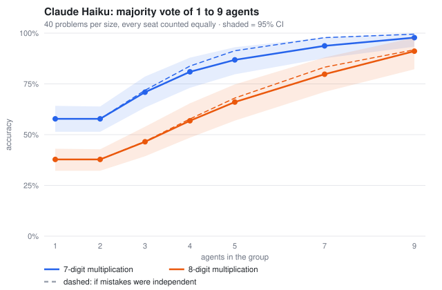
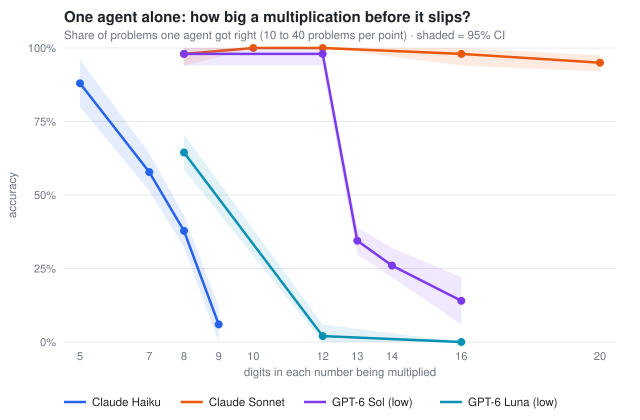
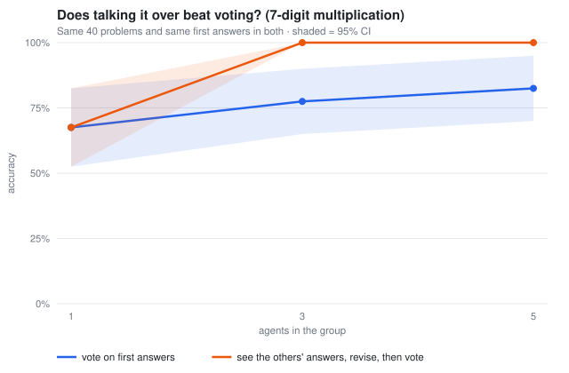

# nagents

**Do more AI agents beat one? Measured.**

Ask several AI agents the same question. Take the most common answer.
Does that beat asking one agent? nagents checks. It gives the same problems
to groups of 1, 3, 5, 7 and 9 agents, grades every answer, and shows what
each extra agent adds and costs. Every reply is saved, so every number
traces back to what an agent said.

## What we found

We asked Claude Haiku, Claude Sonnet, GPT-6 Sol and GPT-6 Luna to multiply
big numbers in their heads, with no tools.



**1. Voting works.** One Haiku got 7-digit problems right 58% of the time.
Nine Haikus voting got 98%. The agents rarely make the *same* mistake, so
the right answer wins even when most agents are wrong.

**2. It works for GPT too.** One GPT-6 Luna got 8-digit problems right 64%
of the time; nine voting got 98%. GPT-6 Sol on 13 digits went from 34% to
87%, even though it refused to answer about half the problems.

**3. A stronger model beats a crowd.** Sonnet was still right 95% of the
time on 20-digit problems. Five Sonnets voting got every one right.



**4. Talking it over beats voting.** When 3 agents could see each other's
answers and fix their own, they got all 40 problems right. A plain vote got
78%. It cost about 2.6 times the tokens.



**5. Use an odd number.** Two agents are no better than one. When they
disagree, it's a coin toss.

## Try it (free, 10 seconds)

```bash
python3 -m nagents run --mock --suite chain --depth 8 --trials 40 --sizes 1,3,5,9 --out runs/demo
open runs/demo/report.html
```

This uses a fake built-in model, so no API key is needed. To run real
models, see **[the guide](docs/GUIDE.md)**. Every run behind these charts is
in `study/`, and [SPEC.md](SPEC.md) has the full numbers and caveats.

*Limits: one kind of task (arithmetic) and 40 problems per point. GPT ran
at low effort only.*
